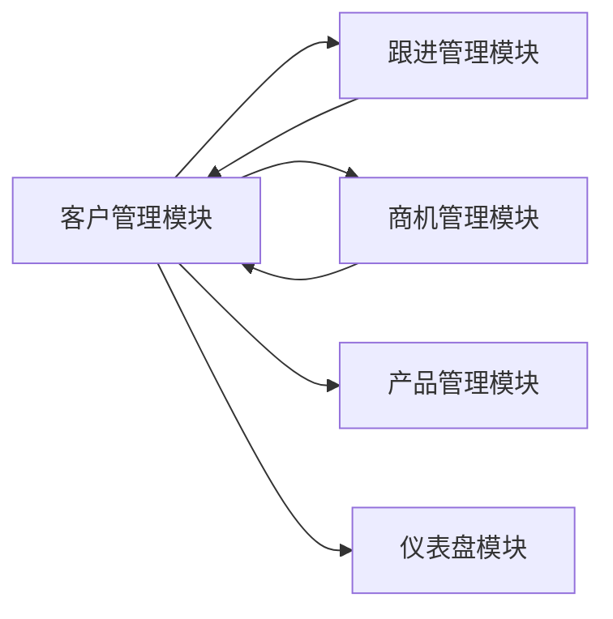

# 客户管理模块概述

## 文档信息

| 项目 | 内容 |
|------|------|
| **模块名称** | 客户管理模块 |
| **模块编码** | MODULE_CUSTOMER |
| **优先级** | P0（最高优先级） |
| **版本号** | v1.0 |
| **创建日期** | 2026-04-09 |
| **作者** | 开发团队 |
| **状态** | 待开发 |

## 变更历史

| 版本 | 日期 | 变更内容 | 作者 |
|------|------|---------|------|
| v1.0 | 2026-04-09 | 初始版本 | 开发团队 |

---

## 一、模块简介

### 1.1 功能目标

客户管理模块是CRM系统的核心模块，负责管理企业客户的全生命周期信息，包括：
- 客户基础信息管理
- 联系人管理
- 客户标签管理
- 客户资源池管理
- 客户导入导出

### 1.2 业务价值

1. **集中管理客户信息**: 统一管理所有客户资料，避免信息分散
2. **提升销售效率**: 快速查找客户信息，支持精准营销
3. **防止客户流失**: 客户保护期机制，避免内部抢单
4. **数据驱动决策**: 客户数据分析，支持业务决策

### 1.3 适用范围

| 用户角色 | 功能权限 |
|---------|---------|
| 销售人员 | 查看、创建、编辑自己负责的客户 |
| 销售主管 | 查看、管理团队成员的客户 |
| 系统管理员 | 全部权限 |

---

## 二、功能架构

### 2.1 功能结构图

```
客户管理模块
├── 客户档案管理
│   ├── 客户列表
│   ├── 客户详情
│   ├── 新增客户
│   ├── 编辑客户
│   └── 删除客户
├── 联系人管理
│   ├── 联系人列表
│   ├── 新增联系人
│   ├── 编辑联系人
│   └── 删除联系人
├── 客户标签管理
│   ├── 标签列表
│   ├── 添加标签
│   └── 移除标签
├── 客户资源池
│   ├── 公海池
│   ├── 私海池
│   └── 客户分配/领取
└── 数据导入导出
    ├── Excel导入
    └── Excel导出
```

### 2.2 功能清单

| 序号 | 功能点 | 优先级 | 状态 | 说明 |
|------|--------|--------|------|------|
| 1 | 客户列表查询 | P0 | 待开发 | 分页查询、多条件筛选 |
| 2 | 客户详情查看 | P0 | 待开发 | 查看客户完整信息 |
| 3 | 新增客户 | P0 | 待开发 | 创建新客户档案 |
| 4 | 编辑客户 | P0 | 待开发 | 修改客户信息 |
| 5 | 删除客户 | P0 | 待开发 | 软删除客户 |
| 6 | 联系人管理 | P0 | 待开发 | 客户的联系人管理 |
| 7 | 客户标签 | P1 | 待开发 | 客户标签管理 |
| 8 | 客户导入 | P1 | 待开发 | Excel批量导入 |
| 9 | 客户导出 | P1 | 待开发 | Excel导出 |
| 10 | 资源池管理 | P1 | 待开发 | 公海池/私海池 |

---

## 三、关联关系

### 3.1 与其他模块的关系



### 3.2 数据流向

| 方向 | 模块 | 数据 |
|------|------|------|
| 输出 | 跟进管理 | 客户ID、客户名称 |
| 输出 | 商机管理 | 客户ID、客户名称 |
| 输出 | 仪表盘 | 客户统计数据 |
| 输入 | 系统管理 | 用户ID、部门ID |

---

## 四、核心概念

### 4.1 客户状态

| 状态 | 说明 | 业务规则 |
|------|------|---------|
| ACTIVE | 正常 | 可以正常开展业务 |
| INACTIVE | 停用 | 停止新业务，已有合同继续执行 |
| LOCKED | 锁定 | 禁止任何业务操作 |

### 4.2 客户等级

| 等级 | 说明 | 判断标准 |
|------|------|---------|
| A | 核心客户 | 年采购额≥500万，合作≥3年 |
| B | 重要客户 | 100万≤年采购额<500万，合作≥1年 |
| C | 普通客户 | 年采购额<100万，合作<1年 |

### 4.3 资源池类型

| 类型 | 说明 | 业务规则 |
|------|------|---------|
| PUBLIC | 公海池 | 无人负责的客户，可被领取 |
| PRIVATE | 私海池 | 已被销售人员领取的客户 |

---

## 五、文档清单

本模块包含以下文档：

| 序号 | 文档名称 | 说明 |
|------|---------|------|
| 1 | 00-模块概述.md | 本文件，模块总体介绍 |
| 2 | 01-需求规格说明书.md | 详细功能需求 |
| 3 | 02-数据库设计.md | 表结构设计 |
| 4 | 03-API接口文档.md | 接口定义 |
| 5 | 04-前端页面设计.md | 页面原型和交互 |
| 6 | 05-测试用例.md | 测试用例 |

---

## 六、开发计划

| 阶段 | 任务 | 工期 | 负责人 |
|------|------|------|--------|
| 第1周 | 数据库设计、接口开发 | 3天 | 待定 |
| 第1周 | 前端页面开发 | 4天 | 待定 |
| 第2周 | 功能联调、测试 | 3天 | 待定 |

---

**文档版本**: v1.0  
**创建日期**: 2026-04-09  
**维护人**: 开发团队
