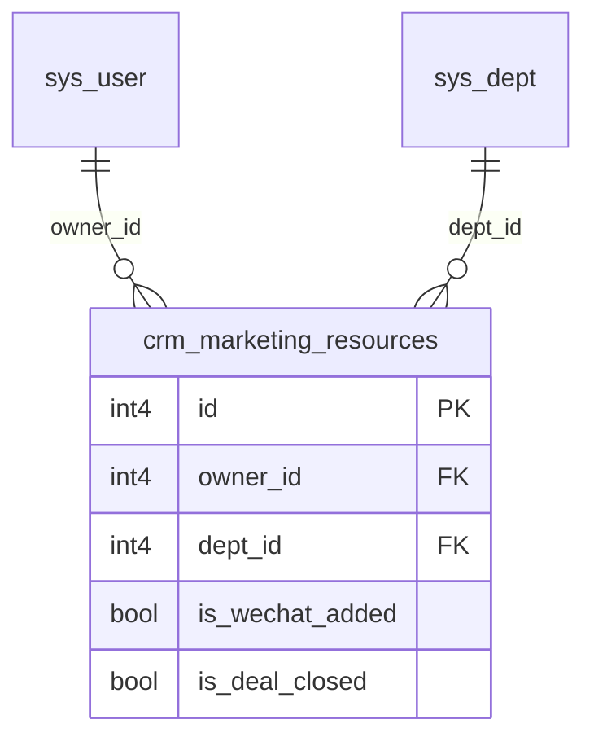

# crm_marketing_resources 建表说明

## 1. 概述

| 项 | 说明 |
|---|---|
| **表名** | `crm_marketing_resources` |
| **中文名** | 营销资源台账 |
| **用途** | 记录营销/渠道留资资源（来源、查重、画像、成交等） |
| **数据库** | PostgreSQL，`public` schema |
| **归属关联** | `owner_id` → `sys_user.id`（逻辑外键，脚本不强制 FK，与现有 CRM 表策略一致） |

## 2. 字段映射（业务 → 数据库）

| 序号 | 业务列名 | 字段名 | 类型 | 可空 | 说明 |
|:---:|:---|:---|:---|:---:|:---|
| — | 主键 | `id` | `int4` | N | 自增，序列 `crm_marketing_resources_id_seq` |
| 1 | 序号 | `serial_no` | `int4` | Y | 台账/Excel 行号，**≠** `id` |
| 2 | 月份 | `month_period` | `varchar(7)` | Y | `YYYY-MM` |
| 3 | 资源获取时间 | `resource_acquired_at` | `timestamp(6)` | Y | |
| 4 | 姓名 | `contact_name` | `varchar(100)` | Y | |
| 5 | 手机号 | `phone` | `varchar(50)` | Y | |
| 6 | 小鹅通查重 | `xiaoe_duplicate_check` | `varchar(200)` | Y | 查重结果文案 |
| 7 | 资源来源 | `resource_source` | `varchar(100)` | Y | |
| 8 | 资源路径/地址 | `resource_path` | `text` | Y | |
| 9 | 归属 | `owner_id` | `int4` | Y | **关联 `sys_user.id`** |
| 10 | 留资问题 | `lead_question` | `text` | Y | |
| 11 | 是否加V | `is_wechat_added` | `bool` | Y | 见 §2.1 |
| 12 | 真实姓名 | `real_name` | `varchar(100)` | Y | |
| 13 | 是否有产业背景 | `has_industry_background` | `bool` | Y | |
| 14 | 是否交易ETF | `trades_etf` | `bool` | Y | |
| 15 | 是否交易港美股 | `trades_hk_us_stocks` | `bool` | Y | |
| 16 | 是否交易商品期货 | `trades_commodity_futures` | `bool` | Y | |
| 17 | 交易资金 | `trading_capital` | `varchar(100)` | Y | 区间或描述 |
| 18 | 客户基本情况 | `customer_profile` | `text` | Y | |
| 19 | 客户需求 | `customer_demand` | `text` | Y | |
| 20 | 计划推荐 | `planned_recommendation` | `text` | Y | |
| 21 | 是否成交 | `is_deal_closed` | `bool` | Y | `true`=已成交，`false`=未成交 |
| 22 | 成交金额 | `deal_amount` | `numeric(15,2)` | Y | 元 |
| 23 | 微信号 | `wechat_id` | `varchar(100)` | Y | |
| 24 | 其他联系方式 | `other_contact` | `text` | Y | |

### 2.1 `bool` 可空字段语义

| 库值 | 含义 |
|:---:|:---|
| `NULL` | 未填写 / 未知 |
| `true` | 是 |
| `false` | 否 |

涉及字段：`is_wechat_added`、`has_industry_background`、`trades_etf`、`trades_hk_us_stocks`、`trades_commodity_futures`、`is_deal_closed`。

> **说明**：原 Excel「跟进中」无法用单一 boolean 表达；若业务需要三态成交状态，后续可加 `deal_status varchar(20)`，`is_deal_closed` 仅表示是否已成交。

### 2.2 归属 `owner_id`

- 对应业务列「归属」，存销售用户在 `sys_user` 中的 `id`。
- 列表展示通过 JOIN `sys_user` 取 `nickname` / `username`。
- 外键约束见 `03-crm-foreign-keys-OK.sql` 统一补充（本次 DDL 不建 FK）。

## 3. 标准审计字段

| 字段名 | 类型 | 说明 |
|:---|:---|:---|
| `created_id` | `int4` | 创建人 → `sys_user.id` |
| `updated_id` | `int4` | 更新人 → `sys_user.id` |
| `created_time` | `timestamp(6)` | 默认 `now()` |
| `updated_time` | `timestamp(6)` | 默认 `CURRENT_TIMESTAMP` |
| `is_deleted` | `bool` | 默认 `false` |
| `deleted_time` | `timestamp(6)` | |
| `deleted_id` | `int4` | |
| `uuid` | `varchar(64)` | 默认 `gen_random_uuid()` |
| `description` | `text` | 系统备注 |
| `dept_id` | `int4` | → `sys_dept.id` |

## 4. 索引

| 索引名 | 字段 |
|:---|:---|
| `idx_crm_marketing_resources_phone` | `phone` |
| `idx_crm_marketing_resources_month` | `month_period` |
| `idx_crm_marketing_resources_acquired_at` | `resource_acquired_at` |
| `idx_crm_marketing_resources_source` | `resource_source` |
| `idx_crm_marketing_resources_owner_id` | `owner_id` |
| `idx_crm_marketing_resources_dept_id` | `dept_id` |
| `idx_crm_marketing_resources_deleted` | `is_deleted`, `deleted_time` |

## 5. 约束

- 主键：`crm_marketing_resources_pkey` → `id`
- 无业务唯一约束（同手机号可多条留资）

## 6. 执行

```bash
docker exec -i fastapiadmin-postgres psql -U postgres -d fastapiadmin \
  < backend/sql/postgres/08-crm-marketing-resources.sql
```

## 7. ER（逻辑关系）


